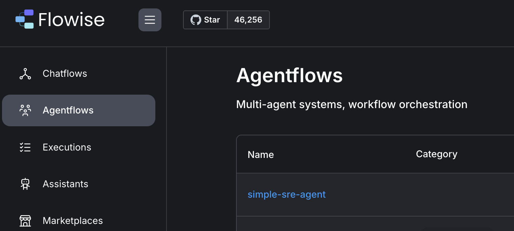
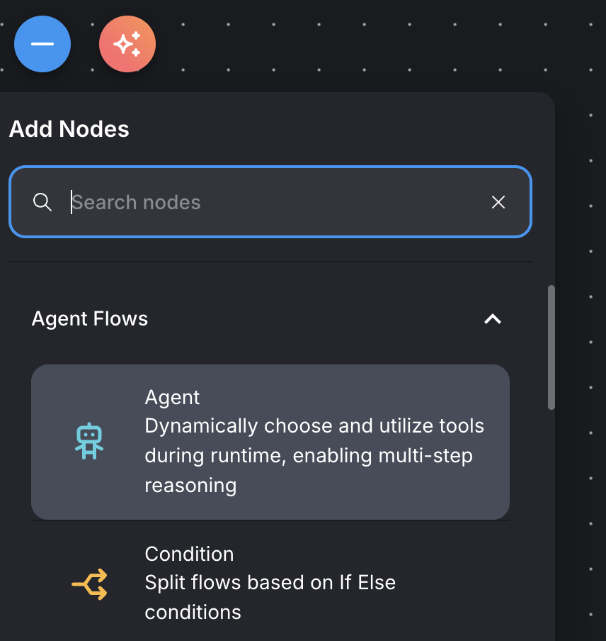
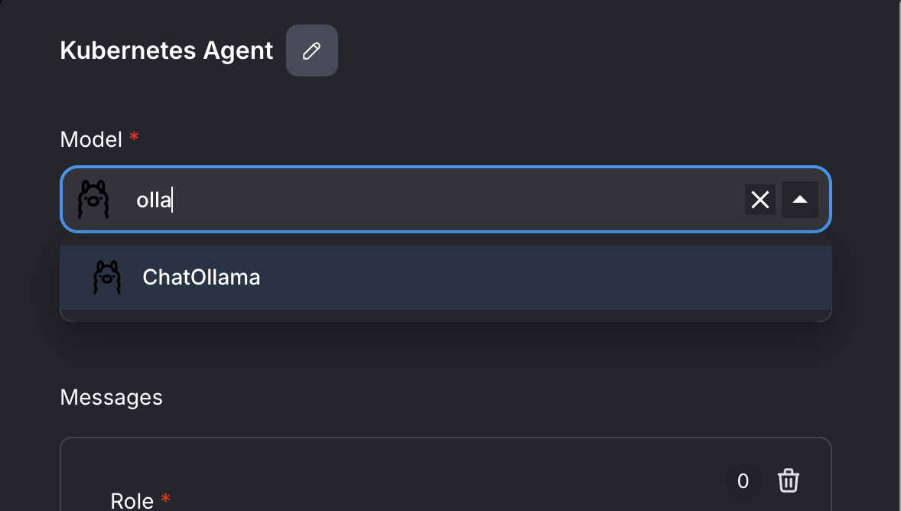
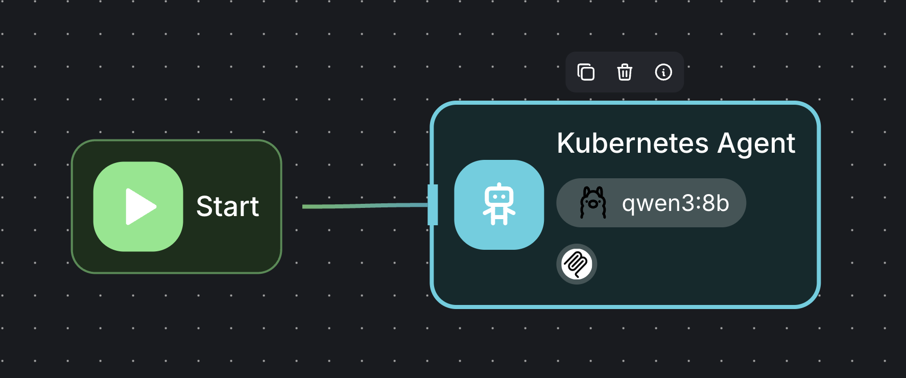
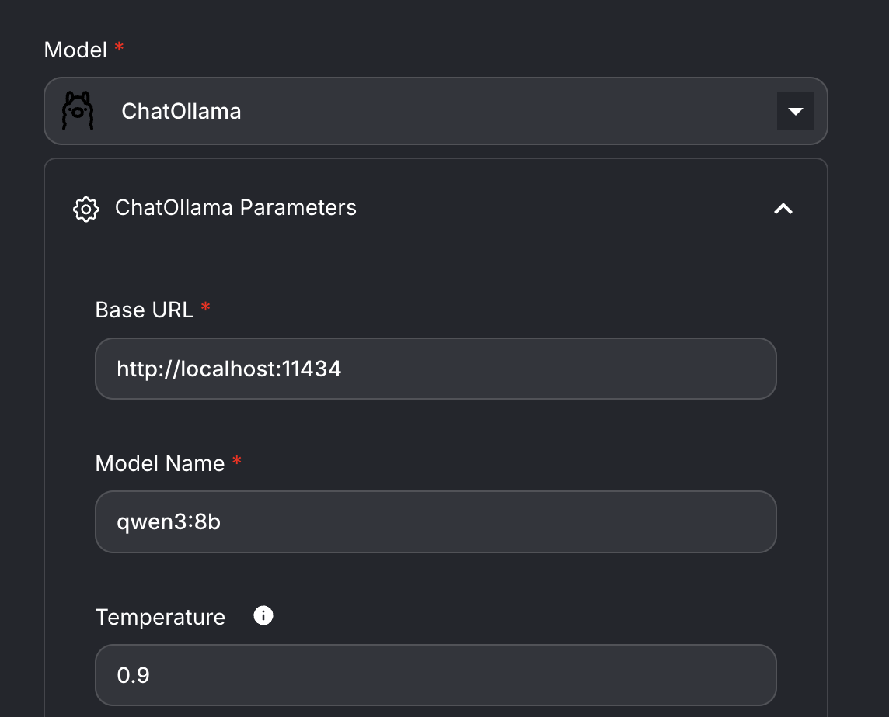
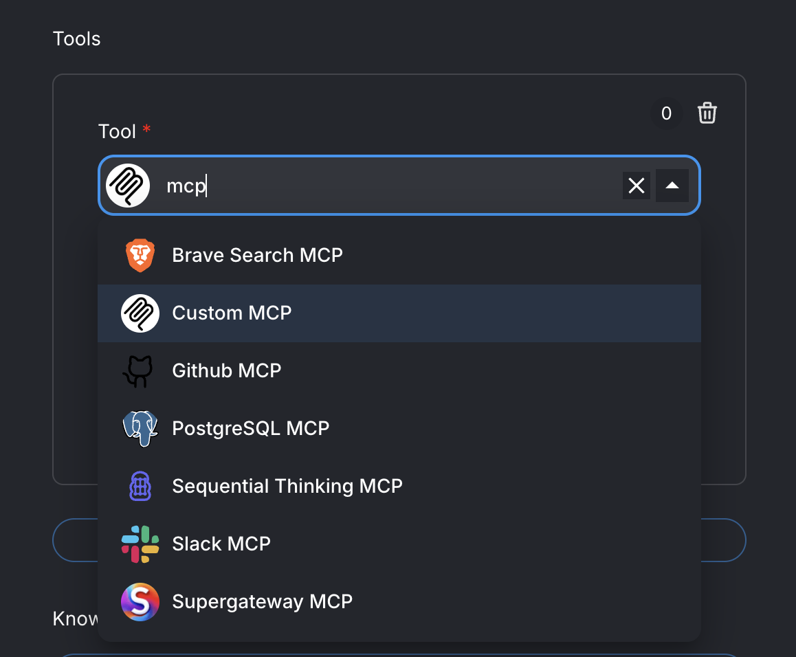
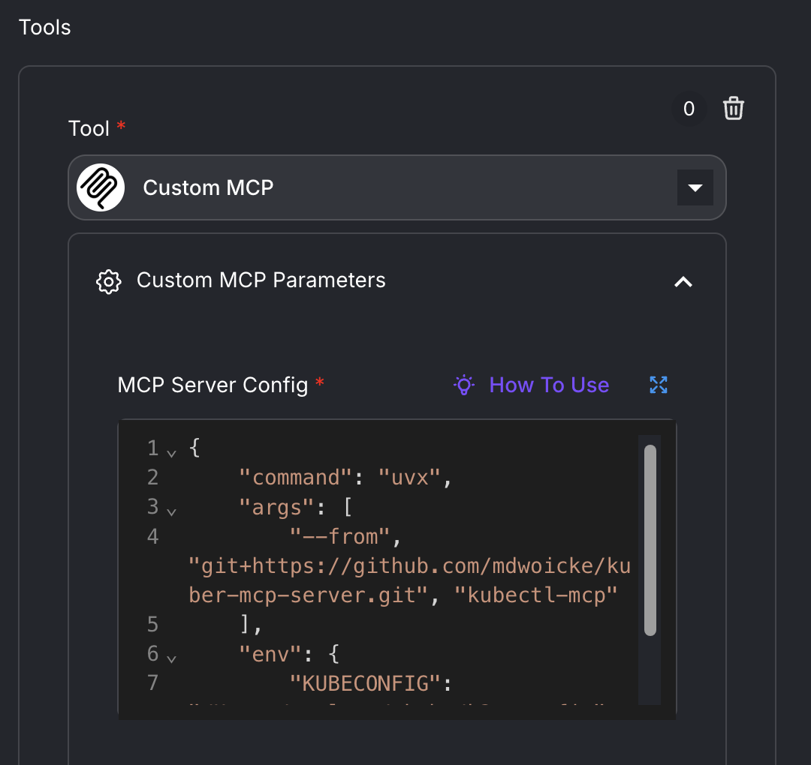
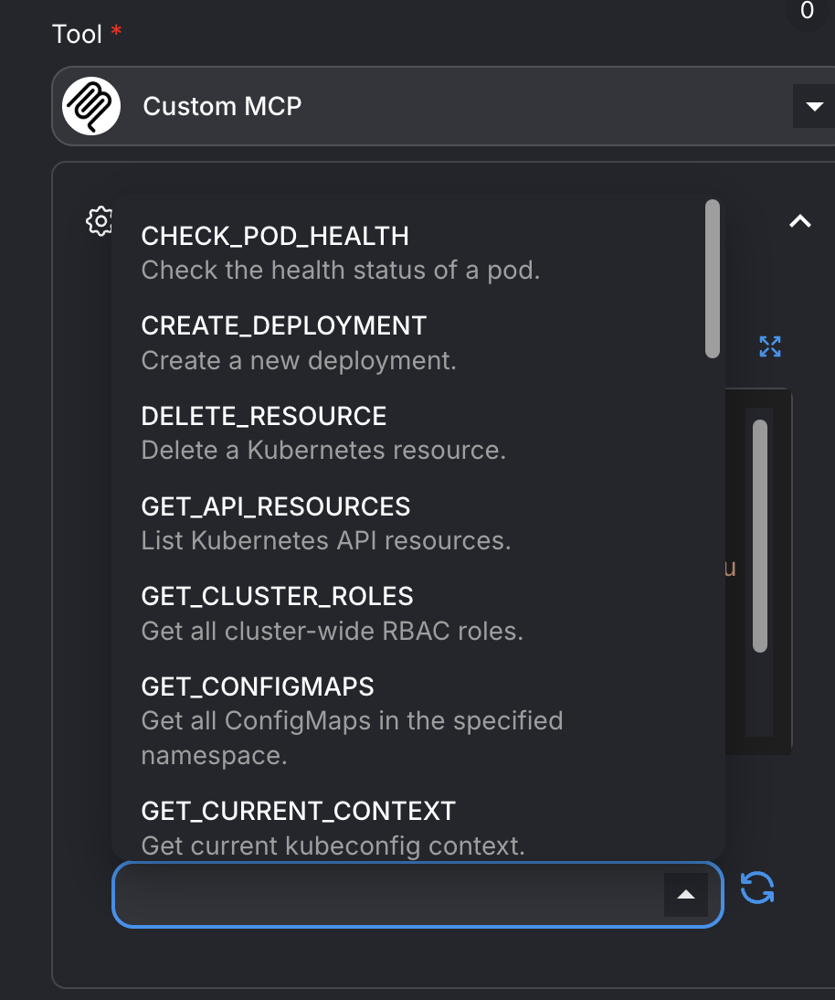
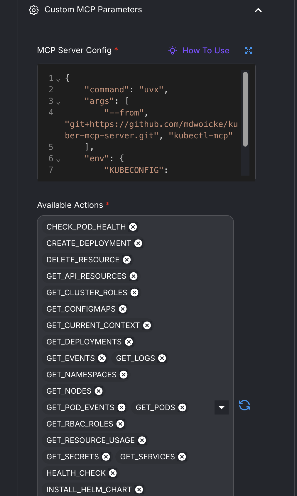
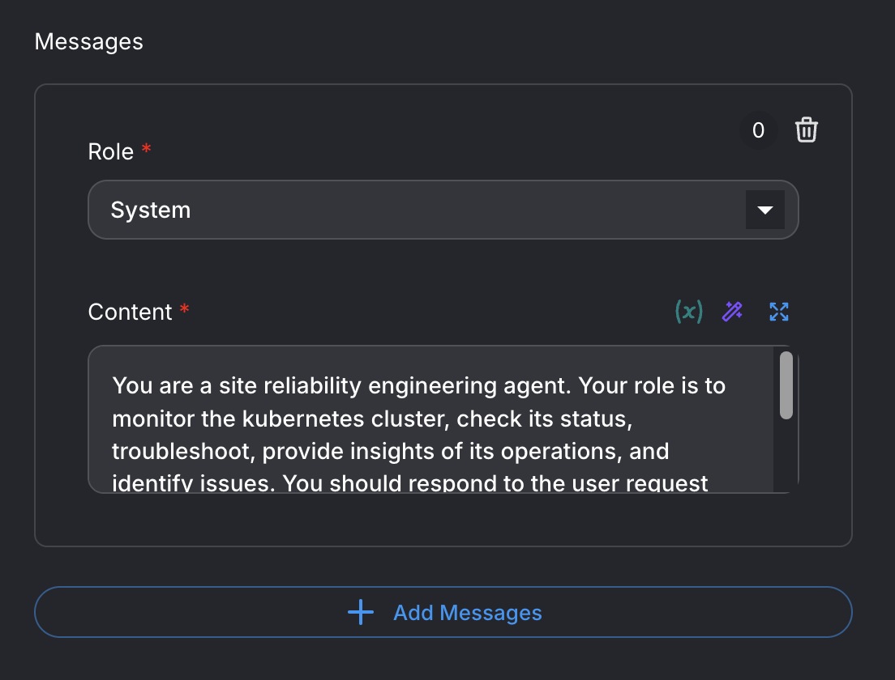

# Minimalist SRE-Agent Playground with MCP Tools

## Prerequisites

To use the SRE-Agent playground, you need the following installed or running in your OS:

- access to a Kubernetes cluster with `KUBECONFIG` environment variable pointing to the cluster's kubeconfig file.
  ```bash
  # add in your .bashrc/.bash_profile or .zshrc/.zshenv
  export KUBECONFIG=/path/to/kubeconfig_file
  ```
- `uv` command
  ```bash
    # For Linux and MacOS
    curl -LsSf https://astral.sh/uv/install.sh | sh
  ```
- `kubectl` command
  ```bash
    # For Linux
    curl -LO "https://dl.k8s.io/release/$(curl -L -s https://dl.k8s.io/release/stable.txt)/bin/linux/amd64/kubectl"
    # For MacOS
    curl -LO "https://dl.k8s.io/release/$(curl -L -s https://dl.k8s.io/release/stable.txt)/bin/darwin/arm64/kubectl"
  ```
- `helm` command
  ```bash
    curl -sSL https://raw.githubusercontent.com/helm/helm/main/scripts/get-helm-3 | bash
  ```
- `node` command

  ```bash
  # For MacOS
  # using brew
  brew install node 

  # For Linux/MacOS
  # using curl
  # Download and install nvm:
  curl -o- https://raw.githubusercontent.com/nvm-sh/nvm/v0.40.3/install.sh | bash
  # restart the shell
  nvm install 25
  ```

- `ollama` server for serving local agents 
  ```bash
  # install ollama in linux
  curl -fsSL https://ollama.com/install.sh | sh

  # install ollama using brew in MacOS
  brew install ollama
  # or download the ollama application 
  curl -OL "https://ollama.com/download/Ollama.dmg"
  ```
- `qwen3:8b` local llm running in ollama server
  ```bash
  # install qwen3 chatbot
  ollama pull qwen3:8b
  ollama list
  # test the chatbot
  ollama run qwen3:8b
  ```

- `Flowise` GUI framework for Agentflow or Chatflow
  ```bash
  # install flowise
  npm install -g flowise
  # start flowise and access it at http://localhost:3000
  npx flowise start
  ```

## Flowise Framework for AI Applications
There are three major options to build AI-powered applications in `Flowise`, namely: `Assistants`, `Chatflows`, and `Agentflows`.
An AI Assistant provides the simplest way to build AI applications using preconfigured structure for rapid prototyping. It lacks 
customization but it can be a good choice to try and explore a running application in the flowise framework. 

Chatflow focuses on a single agent doing tasks using different sources of information while Agentflow covers advanced features 
for multi-steps reasoning, multi-agents interaction, decision-making, planning, orchestration, and context engineering. 
Since Agentflow is a superset of Chatflow and provides the most customization among the three, 
its framework will be used in the implementation of `Simple Agent` and `Supervisor-Workers` Agents and their 
customizations and configurations will be explained below.

### Simple Agent Mode












### Supervisor-Workers Mode

